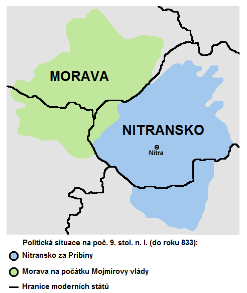

# Veľká Morava

(833-906)

Po zániku Samovej ríše – hradiská : mocenské , územnosprávne a remeselnícko – obchodné centrá

## Nitrianske kniežatstvo

 - **CHRISTIANIZÁCIA**
   - arcibiskup Adalrám
 - knieža Pribina je vyhnaný z Nitry a uteká do Blatnohradu (Balaton)

## Moravské kniežatstvo

 - 

**833 vzniká Veľká Morava** - Moravské + Nitrianske kniežatstvo

\pagebreak

## Veľká Morava

 - **Mojmír I.** - prvý panovník
   - Porazil Pribinu a vyhnal ho
   - zjednotil ríšu
   - odmietol platiť Frankom vazalské poplatky

 - **Rastislav**
   - Veľmi šikovne sa snažil zbaviť Frankov
   - Chcel cirkevnú samostatnosť
   - Požiadal o pomoc Byzantského cisára Michala III. a pápeža
     - poslal sem Konštantína a metoda
   - je v očiach Frankov odsúdený
 - **Svätopluk**
   - odmietal proslovanské myšlienky
   - prichádzajú Frankovia a robia povstanie

> **ROK 870 VEĽKÁ MORAVA vs FRANKOVIA** let's fight

 - Poggers oni vyhrali
 - **LMAO franský panovník dá Svätopluka na vedenie Franského vojska**
   - haha Svätopluk porazil Frankov
 - Svätopluk bol nominovaný kráľom

 - Asi späťnásobil ríšu
