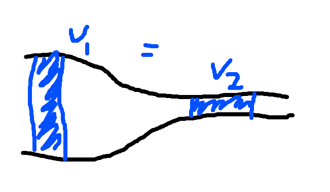
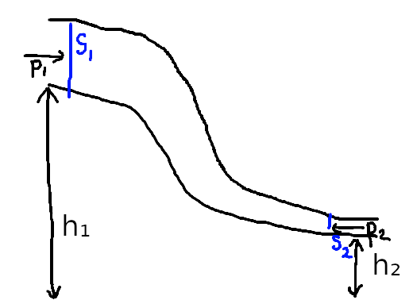

# tekutiny

## bernoulliho princíp, bernoulliho rovnica

### Rovnica spojitosti

**Predpoklad**:

> V celom stĺpci tekutiny (kvapalina, plyn) je rýchlosť prúdenia konštantná

**Myš**lienka

> tekutina sa v uzavretej trubici pri tečení nehromadí - objem tekutiny sa zachová pre časové úseky

**Objemový prietok** Qv = dv/dt = v S = **konštanta**

> v_1 S_1 = v_2 S_2

**Hmotnostný prietok** Qm = %rho

> Qv = %rho v S

### Bernoulliho rovnica

 - vpodstate zákon zachovania energie ale tak bruh
 - vzťah medzi tlakom v tekutine a zmenou mechanickej energie

> p_1 + 1/2%rho v_1^2 + %rho h_1 g = const

- dá sa to odvodiť nebudem to sem písať lmao dám to sem keď to budeme robiť na hodine
