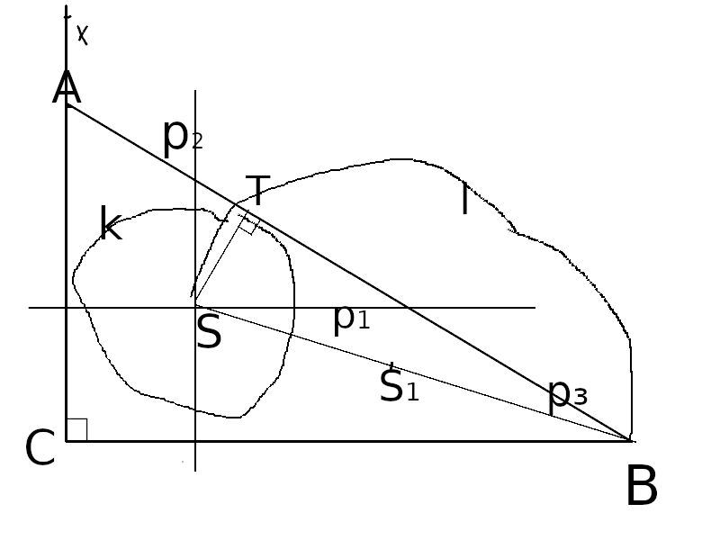

# Úloha 3

> Zostrojte všetky pravouhlé trojuholníky ABC s pravým uhlom pri vrchole C, ak je dané $a = 6$, $\rho = 2$ ($\rho$ je polomer kružnice vpísanej

## Zápis

$a = 6$

$\rho = 2$

$|XCB| = 90°$

## Rozbor

tak pozrime sa, čo vieme:

$S = p_1 \cap p_2; p_1 || CB; |p_1 CB| = 2; p_2 \parallel AC; |p_2 AC| = 2$

$S_1; S_1 \in SB; |S_1 S| = |S_1 B|$

$T \in k \cap l; k(S, 2 ); l(S_1, |S S_1|)$

$A \in p_3 \cap CX; TB \in p_3$

## Postup

1. $CB; |CB| = 6$
2. $p_1, p_2; p_1 || CB; |p_1 CB| = 2 ; p_2 || AC; |p_2 AC| = 2$
3. $S; S \in p_1 \cap p_2$
4. $S_1; S_1 \in SB; |S_1 S| = |S_1 B|$
5. $k; k(S, 2)$
6. $l; l(S_1, |S S_1|)$
7. $T; T \in k \cap l$
> **ale pozor**, tu počítame ten prienik ďalej od bodu C, lebo ten bližšie pri ňom nám dá hlúposť (to som nevedl matematicky zapísať, tak to tu aj vysvetlím
8. $p_3; TB \in p_3$
9. $A; A \in CX \cap p_3; |XCB| = 90\°$
10. $\triangle ABC$

## Konštrukcia

nie sú tam jednotky, nemusíme; vpodstate je to skoro parametrická úloha, až na to že nie.

## Diskusia

Od úsečky CB potom staviame bod X, pri ktorom potom leží aj bod A, takže to nám rovinu nijako nerozdelí, no možnosti nastávajú pri $p_1$ a $p_2$, kde potom môžeme kružnicu zostrojiť do štyroch smerov
