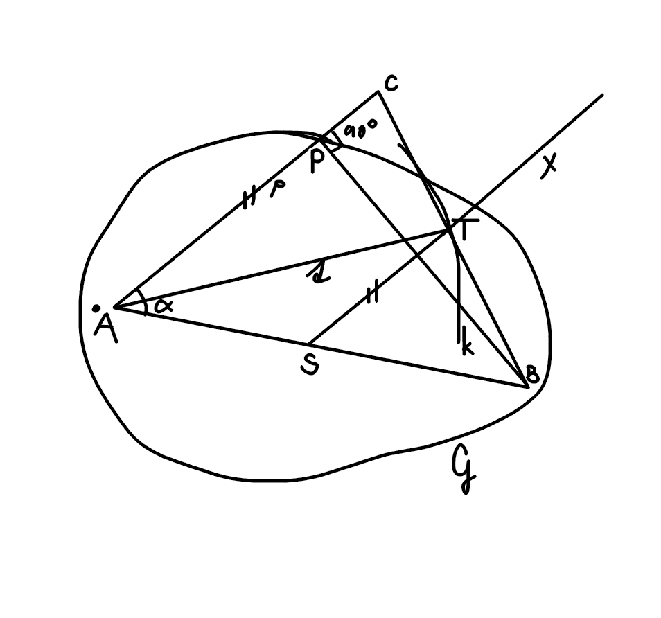

#Úloha 1

> Zostrojte všetky trojuholníky ABC, ak je dané: $\alpha, v_b, t_a$, kde $0 < \alpha < 180^o , v_b > 0, t_a  > 0$

## Zápis

$\triangle ABC$

$\alpha$

$v_b$

$t_a$

tak v trojuholníku ani asi nemôže byť uhol väčší ako $180^o$, to by ani trojuholník nebol. a rovnako s tými dĺžkami strán

## Rozbor

$p; p \perp \overline{BP} ; P \in p$

$A; a \in G_{\alpha}(BP) \cap p$

$S; |SA| = |SB|; S \in \overline{AB}$

$X; \overline{SX} || \overline{AX}$

$k; k(A, t_a)$

$T; T \in k \cap \overrightarrow{ST}$

$C; C \in p \cap \overrightarrow{BT}$

## Postup

1. $PB; |PB| = v_b$
2. $p; p \perp \overline{BP} ; P \in p$
3. $A; a \in G_{\alpha}(BP) \cap p$
4. $S; |SA| = |SB|; S \in \overline{AB}$
5. $X; \overline{SX} || \overline{AX}$
6. $k; k(A, t_a)$
7. $T; T \in k \cap \overrightarrow{ST}$
8. $C; C \in p \cap \overrightarrow{BT}$
9. $\triangle ABC$

## Konštrukcia

irelevantná

## Diskusia

oh no to som ešte nerobil
