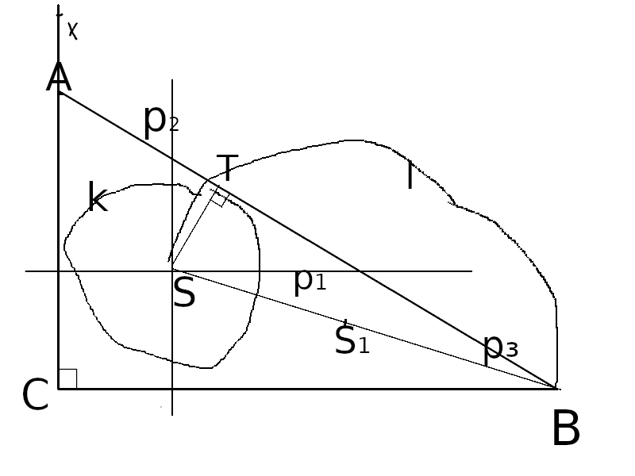

# Úloha 3

> Zostrojte všetky pravouhlé trojuholníky ABC s pravým uhlom pri vrchole C, ak je dané $a = 6$, $\rho = 2$ ($\rho$ je polomer kružnice vpísanej

## Zápis

$a = 6$

$\rho = 2$

$|XCB| = 90°$

## Rozbor

 - body
   - dané
     - B, C
   - hľadané
     - A

$S = p_1 \cap p_2; p_1 || CB; |p_1 CB| = 2; p_2 \parallel AC; |p_2 AC| = 2$

$S_1; S_1 \in SB; |S_1 S| = |S_1 B|$

$T \in k \cap l; k(S, 2 ); l(S_1, |S S_1|)$

$A \in p_3 \cap CX; TB \in p_3$

## Postup

1. $CB; |CB| = 6$
2. $X; |XCB| = 90°$
3. $p_1; p_1 || CB; |p_1 CB| = 2$
4. $p_2, p_2 || XC; |p_2 XC| = 2$
4. $S; S \in p_1 \cap p_2$
5. $S_1; S_1 \in SB; |S_1 S| = |S_1 B|$
6. $k; k(S, 2)$
7. $l; l(S_1, |S S_1|)$
8. $T; T \in k \cap l$

> **ale pozor**, tu počítame ten prienik ďalej od bodu C, lebo ten bližšie pri ňom nám dá hlúposť (to som nevedl matematicky zapísať, tak to tu aj vysvetlím

9. $p_3; TB \in p_3$
10. $A; A \in CX \cap p_3$
11. $\triangle ABC$

## Konštrukcia

## Diskusia

Priamku CB máme danú, čiže nám možnosti nerozdeľuje, riešenia sú dve.
