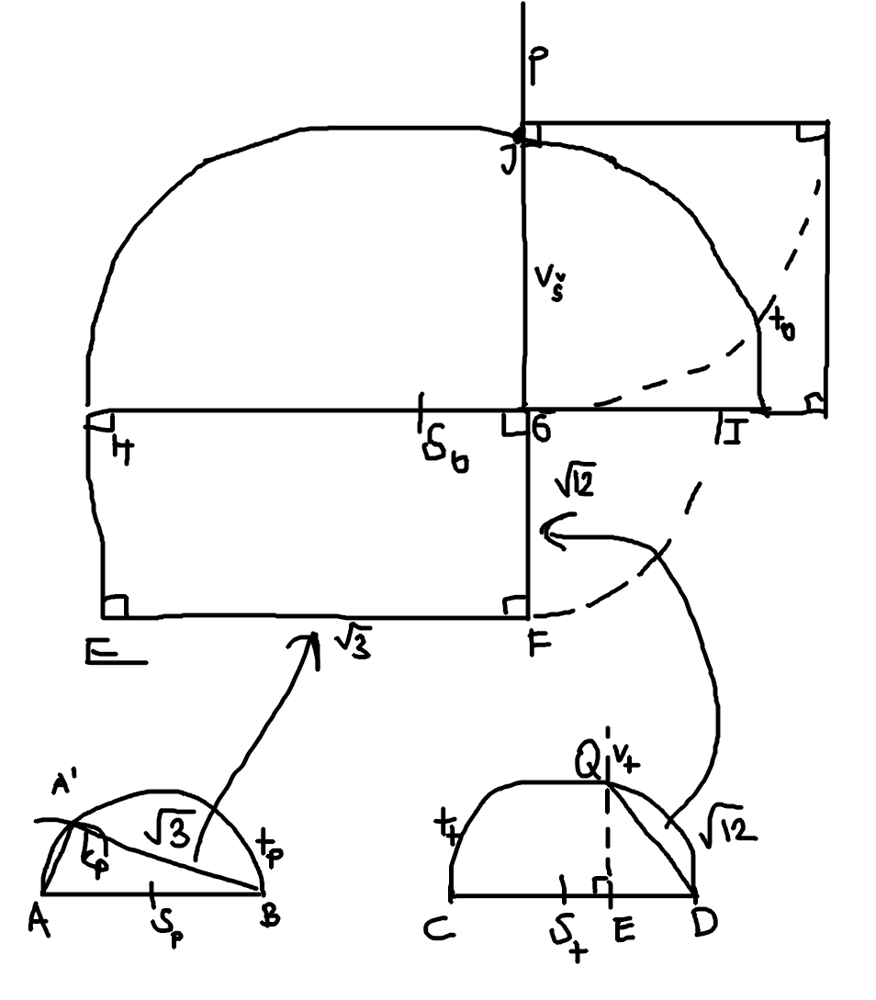

# Úloha 4

K obdĺžniku s rozmermi $\sqrt{12}$ cm a $\sqrt{3}$ cm zostrojte štvorec rovnakého obsahu. Stranu obdĺžnika dĺžky $\sqrt{3}$ zostrojte pomocou Pytagorovej vety, stranu $\sqrt{12}$ zostrojte pomocou Euklidovej vety o odvesne.

## Rozobor

neviem čo všetko tu treba

$\sqrt{3} = \sqrt{2^2 - 1^2}$

 - prepona 2 odvesna 1, robíme pomocou tálesovej kružnice

$12 = 6 \cdot 2$

 - to je príprava na tú tálesovu vetu, spravíme stranu s dĺžkou 6 a potom na nej úsečku s dĺžkou 2

 - potom robíme štvorec pomocou tálesovej vety o výške alebo ako sa volá,- tá druhá

 - áno a $\sqrt{12}$ si dovolím použiť ako názov strany

$|AB| = 2$

$S_p; |A S_p| = |B S_p|$

$t_p(S_p, |A S_p|)$

$k_p(A, 1cm)$

$A' \in k_p \cap t_p$

$\sqrt{3} = \overline{A'B}$

$|CD| = 6cm$

$|ED| = 2 cm; C \in \overline{CD}$

$S_t; |C S_t| = |D S_t|$

$t_t(S_t, |C S_t|)$

$v_t; v_t \perp \overline{CD}; C \in v_t$

$Q \in v_t \cap t_t$

$\sqrt{12} = \overline{QD}$

$|EF| = \sqrt{3}$

$|FG| = \sqrt{12}; |\angle EFG| = 90^o$

ukrátim Vás o bod H

$\square (obdĺžnik) EFGH$

$I \in \overrightarrow{HG}; |GI| = |GF|$

$S_o \in \overline{HI}; |H S_o| = |I S_o|$

$t_o(S_o, |H S_o|)$

$p \perp HI; G \in p$

$J \in t_o \cap p$

$K; \overline{JK} \perp \overline{GJ}; L; \overline{KL} \perp \overline{KJ}$

$\square GJKL$

## Postup

1. $AB, |AB| = 2$
1. $S_p; |A S_p| = |B S_p|$
1. $t_p; t_p(S_p, |A S_p|)$
1. $k_p; k_p(A, 1cm)$
1. $A'; A' \in k_p \cap t_p$
1. $\sqrt{3}; \sqrt{3} = \overline{A'B}$
1. $CD; |CD| = 6cm$
1. $ED; |ED| = 2 cm; C \in \overline{CD}$
1. $S_t; |C S_t| = |D S_t|$
1. $t_t; t_t(S_t, |C S_t|)$
1. $v_t; v_t \perp \overline{CD}; C \in v_t$
1. $Q; Q \in v_t \cap t_t$
1. $\sqrt{12}; \sqrt{12} = \overline{QD}$
1. $EF; |EF| = \sqrt{3}$
1. $FG; |FG| = \sqrt{12}; |\angle EFG| = 90^o$
1. $GH; |GH| = \sqrt{3}; |\angle FGH| = 90^o$
1. $HE; |HE| = \sqrt{12}; |\angle GHE| = 90^o$
1. $\square (obdĺžnik) EFGH$
1. $I; I \in \overrightarrow{HG}; |GI| = |GF|$
1. $S_o; S_o \in \overline{HI}; |H S_o| = |I S_o|$
1. $t_o; t_o(S_o, |H S_o|)$
1. $p; p \perp HI; G \in p$
1. $J; J \in t_o \cap p$
1. $K, L; \overline{JK} \perp \overline{GJ}; \overline{KL} \perp \overline{KJ}$
1. $\square GJKL$

## Konštrukcia

