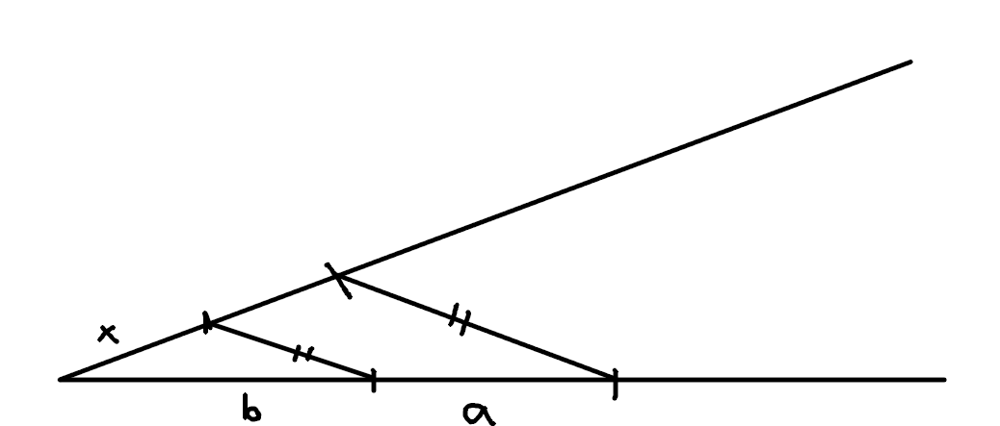

# Úloha 5

> Sú dané úsečky $a,b (a > b)$. Zostrojte úsečku x, pre ktorú platí $x=\frac{ab}{a+b}$

## Zápis

$a,b (a > b)$

$x=\frac{ab}{a+b}$

## Rozbor

$x=\frac{ab}{a+b}$

$\frac{x}{a}=\frac{b}{a+b}$

 - body
   - dané
     - A, D, B, C
   - hľadané
     - E

 - dĺžky

keďže toto bola čiastočne aj logická úloha, zapísal som sem dĺžky

$|AD| = b$

$|DB| = a$

$|AC| = a$

$|EA| = x$

\pagebreak

$\triangle ABC ~ \triangle ADE$

$E \in R \cap q$

## Postup

1. $AD; |AD| = b$
2. $B; B \in \overrightarrow{AD}; |DB| = a; |BA| > |DA|$
3. $q; A \in q$
4. $C; C \in q; |CA| = a$
5. $r; r || CB; D \in R$
6. $E; E \in r \cap q$
7. $x = \overline{AE}$

## Diskusia

V polrovine je jedno riešenie.
