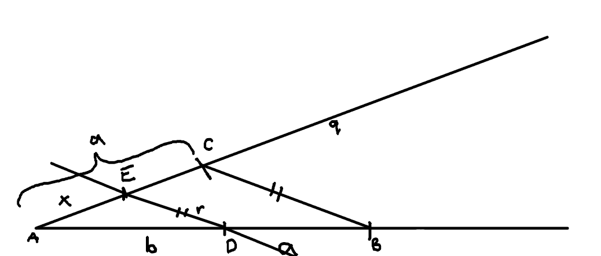

# Úloha 5

> Sú dané úsečky $a,b (a > b)$. Zostrojte úsečku x, pre ktorú platí $x=\frac{ab}{a+b}$

## Zápis

$a,b (a > b)$

$x=\frac{ab}{a+b}$

## Rozbor

$x=\frac{ab}{a+b}$

$\frac{x}{a}=\frac{b}{a+b}$

