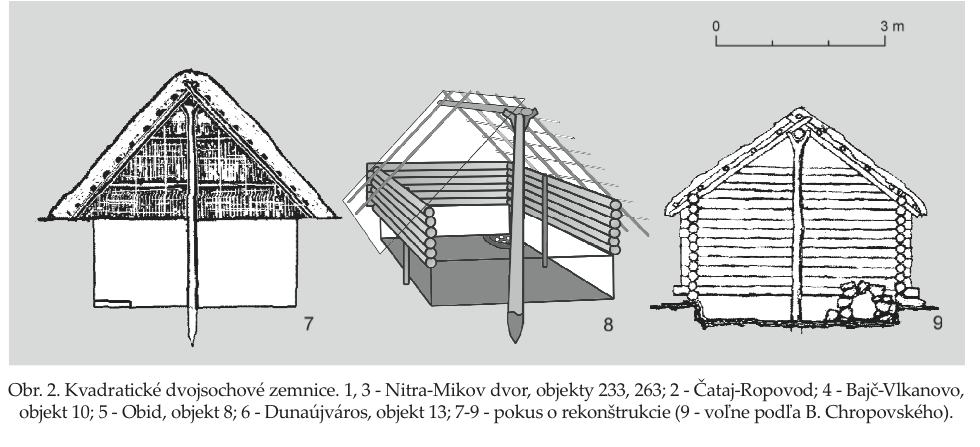

# Slovania

## Osidlovanie

 - pri **visle** sa usadili **venetovia**
   - hovoria si **sklavini** a **anti**
 - ziju pri meste **Novietunum** v delte dunaja a pri **Mursianskom** jazere.
 - takisto ziju v mociaroch a lesoch

**POTOM PRISLI SEM**

v troch roznych smeroch

### 3 smery slovanov

#### Vychodni slovania

 - rusi
 - ukrajinci
 - bielorusi
 
 - vytvorili:
   - kyevsku rus
   - moskovske kniezatstvo
	- kralovstvo srbov
   - ......

#### Juzni slovania

 - bosna a hercegovina
 - bulhari
 - srbi
 - slovinci

### Zapadni slovania

 - poliaci
 - slovaci
 - cechuni
 
 - vytvorili
   - velku moravu
   - ceske kralovstvo
   - polske kralovstvo

### Jazyk
 - slovanske jazyky pochadzaju z indoeuropskeho prajazyka
   - tym sa rozpravalo uz asi 3500 b.c
 - jednotlive dialekty sa potom postupne vyvijali

## Povod slova slovan
 - podla starych geografickych nazvov usudili, ze *slav* moze mat nieco spolocne s riekami a vodou
 - slovania = anti = veneti

## Historicke zmienky
 - Jordanes ich popisuje v 6. Storočí
 - Herodot v 5. Storočí
 - Fredegard

## Strava
 - **MED**
 - ovosne kase
 - polievky
 - mali **KVÁSOK**

\pagebreak

## správanie Slovanov
 - boli sme pohostinní, no k nepriateľom zlí
 - museli sme makať lmoa
   - boli sme veľmi šikovní poľnohospodári
   - ale boli sme aj celkom od fachu remeselníci
 - cestovatelia hovorili, že Slovania boli špinaví

 - šperky nosili muži wtf

## Bývanie
 - hradisko = hrad + isko
   - 10 - 15 domov
     - polozemnice
       - sedlova strecha
       

## Náboženstvo
 - ešte nie kresťanstvo
 - kopa bohov
 - položilo základy spoločenských udalostí a kultúry starovekých Slovanov
   - strava -> tryzma -> kar

## spoločenská hierarchia daria
 - náčelník
 - zeny majú pravá voliť

\pagebreak

# Samova Riša
(623-658)

 - Slovania boli iba barbarsky stat
 - ah ok zobral si nás franský kupec Samo
   - lmao nemal nástupcov
 - napadali nás Avari
 - **bitka pri Vogastisburgu** - Franská ríša vs Slovania
 - 5 rokov na to Samo zomiera
 - O týchto udalostiach nám rozprava fredegarova kronika
