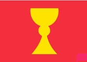

# uhorské kráľovstvo

> 1000 - 1526

keď zanikla veľká morava, vznikajú iné kniežatstvá. na územie vpadol kočovný maďarský kmeň **arpádovcov**.

- 955 **bitka pri rieke lech** - porážka maďarov frankami

po tejto bitke maďari začnú žiť usadlý život blízko slovanov a mnohými spôsobmi s nimi asimilujú.

- gejza a jeho syn vajk spravili maďarom kresťanstvo
- sú poľnohospodári
- spravili si jazyk

## štefan 1. svätý

> 1000 - 1038

- rozširoval kresťanstvo

### zahraničná politika

mal spory s poľskom ( boleslavom chrabrý ), aj so slovenskom

### vnútorná politika

spravil veľa správnych reforiem - rozdelil krajinu na župy - komitáty, hradské obvody. palatín - zástupca kráľa, sudca, taverník, služobíctvo

### christianizácia

za kostol a cirkev platili ľudia - svojím spôsobom zintegroval cirkev so správou štátu.

- cirkevné obvody
- komitáty
- arcibiskupstvá
  - ostrihom
  - eger

## ondrej 2.

bol to vôbec najneschopnejší panovník v existancii maďarov. chcel robiť veľa križiackych výprav, lebo chcel peniaze, no tie výpravy sú skôr taký gambling, lebo to nemuselo byť úspešné. vznikalo napätie medzi panovníkom a šľachotou. aby to skončil, spravil **zlatú bulu** - zmenil krajinu na stavovskú monarchoiu.

### zlatá bula

- **všetci** šlachtici musia chrániť krajinu pred útokmi nepriateľov, no nemusia kráľa nasledovať, keď robí výpravu do inej krajiny
- majetok sa **nebude** udeľovať väčšne
- šľachta **nemusí** platiť dane za majetok
- palatín rozsudzuje všetkých obyvateľov kráľovstva okrem prípadu, že sa jedná o závažnejšie spory medzi šľachtou, kedy nemôže rozhodnúť bez vedomia kráľa
- dcéra dostane tretinu majetku po otcovi
- cudzinci **nemôžu** dostať hodnosť ani komitáty
- keď sa zlatá bula poruší, šľachta môže nepodporovať panovníka
- bula bola vydaná v niekoľkých kópiách

## belo 4.

keď ondrej zomrel, nasledoval po ňom belo. nemal rád zlatú bulu, chcel ešte viac moci ako panovník a oslabiť moc šľachty. na druhej strane podporuje remeselníkov. vytvoril triedu **meštania**, ktorí platili dane, no mali právo na vlastnų volenú samosprávu.

### mestská rada

pozostávala z niekoľkých členov

- 12 konšelov
- na čele richtár

### mestá

- môžu si voliť vlastnú radu
- právo na týždenné trhy
  - lmao preto sa niektoré mestá volajú podľa dňa - plavecký štvrtok, rimavská sobota - vtedy sa oslavovalo
- právo na výročné trhy
- právo skladu
  - každý obchodník, ktorý príde, bude prijatý, no musí tu byť aspoň tri dni a takisto platiť
- míľové právo
  - keď má niekto nejaký biznis, v okruhu jednej míle si nemôže nikto iný postaviť rovnaký
- právo meča
  - môžu robiť popravy - keď sa popravuje, robia sa okolo toho akcie no a to sú ďalšie peniažky
- právo stavať hrad
- právo variť pivo
- právo ťažiť

tieto mestá vznikali najviac na území slovenska. vyvinuli sa z trhových osád.

### cechy

- každý cech má vlastné pravidlá
- na čele cehu stojí **cechmajster**
- **učeň** sa u **majstra** učí asi 3-4 roky
- potom sa stáva **tovarišom**
- ísť na **vandrovku** - na prax

aby sa tovariš stal majstrom, musel spraviť majstrovský kúsok a veľkú hostinu.

## vpád mongolov

> mongoli = tatári

začali útočiť v roku **1241** - zo zlatej hory podnikali výpravy aby nás vylootili. 

**kolonizácia**

- nemecká - zakladali banské mestá
- valašská - rumuni

keď bélo zomrel, nastala **feudálna anarchia**.
ondrej III. sa vyľakal a ušiel.
do popredia sa dostali **matúš čák** alebo **omodejovci**.

**UMREL ONDREJ 3 - vymrel rod arpádovcov**

boje o kráľovstvo:

- **károl robert z anžu** - podporoval ho pápež
- **václav 3.** - podporovali ho oligarchovia
- **otto 3.** - ondejov príbuzný

no a samozrej me vyhral **károl róbert**

**bitka pri rozhanovciach** - zlomil odpor šľachty

## károl róbert z anjou

### peňažná reforma

začal tlačiť mince! vytvoril zameniteľnú menu - dukáty

### portálna daň

porta je brána, ktorou prejde plne naloženný voz s koňským záprahom. keď sa cez ňu prechádza, treba zaplatiť

### banská reforma

keď nájdeš na svojom pozemku zlato, tak si môžeš nechať 1/3 zárobku a 2/3 idú panovníkovi. majiteli baní mohli teda zarábať, lebo bane neboli úplne majetkom štátu

### vyšehrádska dohoda

Ján Luxemburský, Kazimír III a Karol Róbert - mali nejaké obchodné dohody

## Ľudovít 1 (veľký)

veľký lebo robil veľký územný rozmach - pripojil poľsko

mal 2 dcéry - máriu a hedvigu. mária si mala vziať žigmunda luxemburského, no spadla z koňa a zabila seba i dieťa tak vládu prevzal žigi.

## žigmung luxemburský

### placetum regium

ak pápež niečo chce, panovník mu to musí schváliť

### decretum minus

šľachta mala jeden hlas, cirkev mala jeden hlas a mešťania mali jeden hlas

## husitské hnutie

ján hus bol predchodca martina luthera vpodstate - nechcel predávanie odpustkov a podobne. jeho supenci sú husiti a robia nejakú revolúci či čo. btw ján husa bol upálený. husiti boli takisto trochu komunisti. spravili dokonca mesto, kde je každý rovný a keď prídeš, odovzdáš svoje veci a rovno sa rozdelia. významní husita bol **ján žižka**. 

