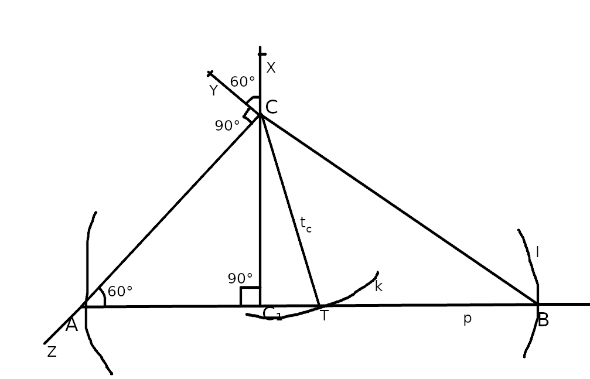
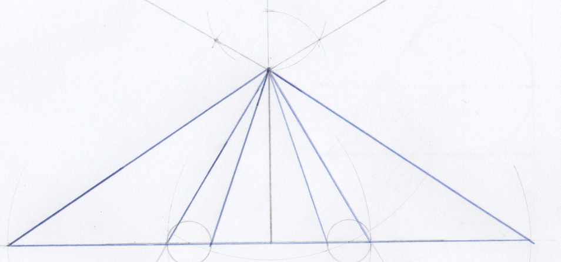

# Úloha 2

> Je daná úsečka $CC1, |CC1| = 5 cm$. Zostrojte všetky trojuholníky $ABC$, pre ktoré je úsečka $CC1$ výškou  $v_c$ a platí:  $t_c = 5,5 cm$;  $\alpha = 60°$. 

## Zápis

$\triangle ABC$

$|C C_1| = 5cm$

$t_c = 5.5cm$

$\alpha = |\angle CAB| = 60^o$

## Rozbor

 - body
   - dané
     - $C$, $C1$
   - hľadané
     - A, B, T, X, Y, Z

no v prvom rade, ja som tu spravil takú menšiu fintu, dúfam, že mi to uznáte:

> vy ste určite chceli, aby sme si spravili množinu G a aby sme ju pretli s $AB$, ale vpodstate nám to ani netreba, keďže poznáme dva uhly v trojuholníku $\triangle C C_2 A$. My **nemôžeme** dopočítavať a tomu rozumiem, no uhol $90^o$ si vieme preniesť a $60^o$ skonštruujeme na mieste a všetko si vieme odčítať aj na obrázku.

### Ok, až toto je samotný rozbor:

$p \perp C C_1; C_1 \in p$

$A \in \overrightarrow{CZ} \cap p; X \in \overrightarrow{C_1 C}; |\angle XCY| = 60^o ; |\angle YCZ| = 90^o$

$T \in k \cap p; k(C, 5.5 cm)$

$B \in l \cap p; l(T, |AT|)$

## Postup

1. $C C_1; |C C_1| = 5 cm$
2. $X; X \in \overrightarrow{C_1 C}; X \notin \overline{C_1 C}$
3. $Y; |\angle XCY| = 60^o$
2. $Z; |\angle YCZ| = 90^o$
3. $p; p \perp \overline{C C_1}; C_1 \in p$
4. $A; A \in p \cap \overrightarrow{CZ}$
5. $k; k(C, 5.5cm)$
6. $T; T \in k \cap p$
7. $l; l(T, |TA|)$
8. $B; B \in p \cap l$
9. $\triangle ABC$

## Konštrukcia

## Diskusia

$T$ sa nám s $p$ pretína v dvoch bodoch, v polrovine sú dve riešenia, čiže štyri dokopy.
