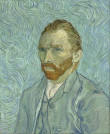
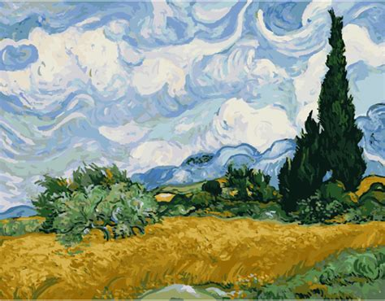

# Postimpresionizmus

 - vpodstate impresionizmus
 - postimpresionimus zosilnuje emocie
 - takisto to vyzerá, že zosilňuje farby

## Vincent Van Gogh

 - spiralovite tahy
   - lmao vraj tym vyjadroval to ze sa mentalne rúca
 - nikdy nestudoval maliarstvo :madmanjoy:
 - v mladosti vela pil a bil sa s gógenom
 - mal deprešiu
   - sám sa poslal do psychiatrickej liečebne
 - rád kreslil umelé osvetlenie

