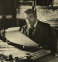

# secesisa

 - posledný umelecký sloh
 - návrat k prírode
 - rozvoj **plagátovej tvorby**

 - secesia ako obdobný prvok používa rastlinný úponok
 - secesná architektúra kombinuje kameň, kov a sklo

## alfonz mucha

 - slovanská epopeja
   - vzdávanie holdu slovanom

## viktor horta

 - architekt
 - tvoril rád z ocele a zo skla
 - známe diela
   - Hotel Tassel
   - Hotel Solvay
   - Hotel Van Eetvelde
   - Hotel Aubecq

## antonio gaugi

 - veľmi originálny
 - krivky, krivky, krivky

**secesia u nás** - budova malej scény štátneho divadla košice

**secesia v maliarstve** - gustav klim
 - používa plátkové zlato

secesia sa prejavuje aj v dnešnej móde
