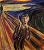
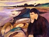

## Expresionizmus

- predchodca eduard münch
  - jeho tvorba predstajue myšlienku expresionizmus
- 80.roky 19. storočia - 20. roky 20. storočia - vtedy ich hiťler zakázal

- a znova:
  - kontrastné farby
  - perspektíva--
  - farby--
- vraj SuBjEkTíVnY PoCiT stfu

- prichádza individualita vnímania do umenia

## Edvard münch

- známe dielo: **výkrik**
  - ukážkové expresionistické dielo
    - silný kontrast
    - silné farby

