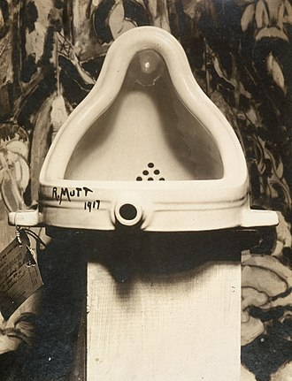

# Dadaizmus

reakcia umeleckej spoločnosti na hrôzy vojny. sarkastické *poznámky*.

kľúccové termíny:

- náhoda
- koláž
- nezmyselnosť
- otázka
- vtip
- *ready-made* \footnote{obyčajný predmet, vybraný umelcom - to mu pridáva hodnotu}

## marcel duchamps

