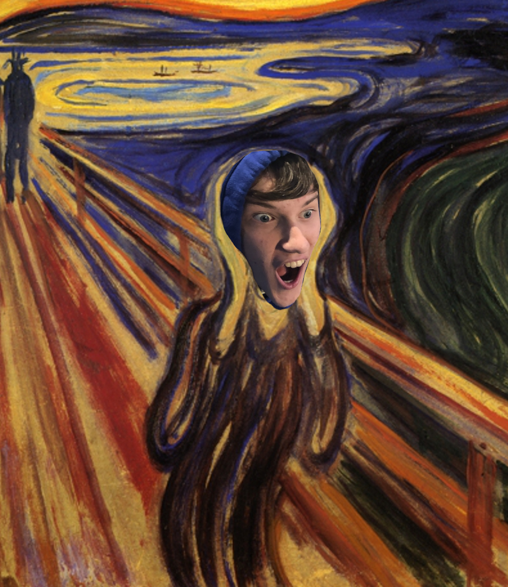

## Expresionizmus

 - predchodca eduard münch
   - jeho tvorba predstajue myšlienku expresionizmus
 - 80.roky 19. storočia - 20. roky 20. storočia - vtedy ich ȟitler zakázal

 - a znova:
   - kontrastné farby
   - perspektíva--
   - farby--
 - vraj SuBjEkTíVnY PoCiT stfu

 - prichádza individualita vnímania do umenia

## Edvard münch

 - známe dielo: výkrik

