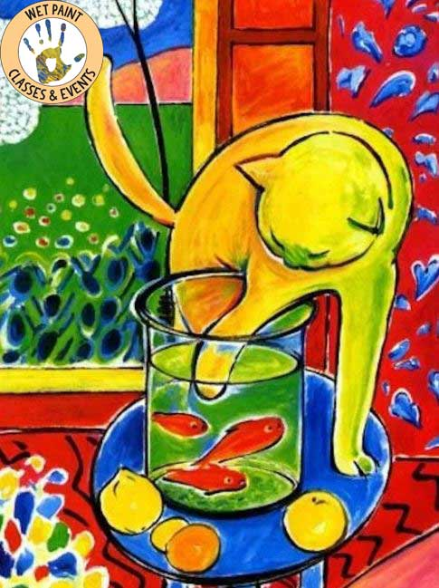

# Fauvizmus

- vyvinutý vo francúzsku
- nesnaží sa až tak zachytiť pocity, no hrá sa s farbami
  - základný vyjadrovací prostriedok je farba
  - farby sa nemiešajú

## Henri Matisse

- lmao vraj začal kresliť v nemocnici
- RGB

