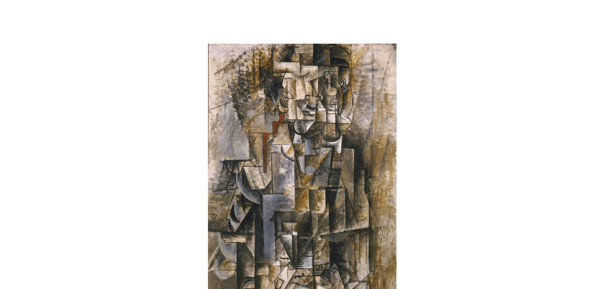

# Kubizmus

- hrá sa s priestorovou koncepciou
  - snaží sa vyobraziť jedno dielo z viacerých uhlov

slávni autori
- george braque
- pablo pikaso

## prekubizmus

dajú sa rozoznať celé tvary, farby nie sú také ostré

## analytický kubizmus

- rozkladá tvary
- dielo dotvára prijímateľ

## syntetický kubizmus

po nasýtení analytickým kubizmu sa vyvíja syntetický kubizmus. prichádzajú **farebné plochy**. prijímateľ stále dotvára obraz, ale nie v takej miere, forma je jasnejšia.

## orfizmus

potom

